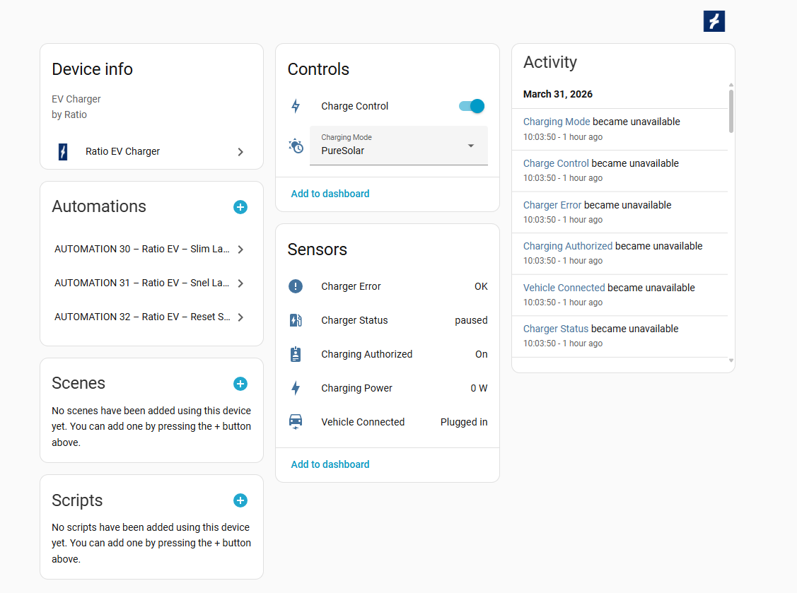
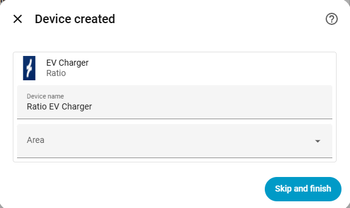

# Ratio EV Charger

Home Assistant integration for Ratio EV Chargers.

## Screenshots

### Setup

Enter your Ratio account credentials to get started.

### Device Created

After successful authentication, your charger is automatically discovered.

### Device Dashboard

Monitor and control your Ratio EV Charger directly from Home Assistant.

## Installation

### HACS (Recommended)

1. Open HACS in your Home Assistant instance.
2. Click the three dots in the top right corner and select **Custom repositories**.
3. Add `https://github.com/RowanRamasray/Ratio_Ev_Charger` and select **Integration** as the category.
4. Click **Add**.
5. Search for "Ratio EV Charger" in HACS and install it.
6. Restart Home Assistant.

### Manual

1. Copy the contents of this repository into `custom_components/ratio_ev_charger/` in your Home Assistant configuration directory.
2. Restart Home Assistant.

## Configuration

1. Go to **Settings** > **Devices & Services** > **Add Integration**.
2. Search for "Ratio EV Charger".
3. Enter your credentials and follow the setup flow.

## Features

- Monitor charger status and sensors
- Start and stop charging sessions
- Select charging modes
